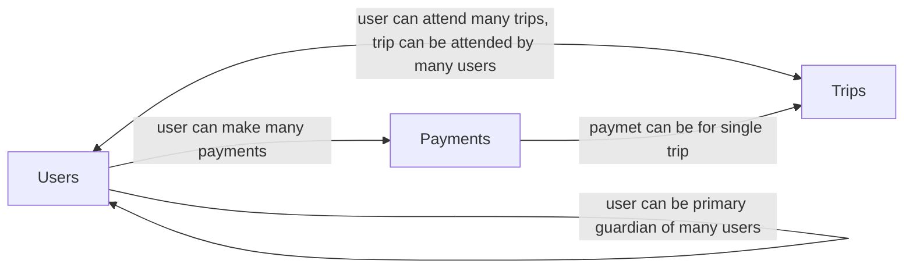

# school-payments-service

School payments service

# Local development

### Requirements

- Ability to run Makefile
- docker and docker-compose

**frontend**

- nodejs
- npm

**backend**

- python
- uv

**db migrations**

- Atlas CLI https://atlasgo.io/getting-started


### Dev servers for convenient development with hot reloading

**Start/stop DB**
```
make docker-db-up
```
```
make docker-db-down
```
```
make docker-db-destroy
```

**run db migrations**
```
make migrate
```

**Start frontend dev server**
```
make dev-frontend
```

**Start backend dev server**
```
make dev-backend
```

### Start/stop entire stack with docker-compose for testing more production like builds running locally containerized
```
docker-compose up --build
```
```
docker-compose down
```

# Python API

## Relational schema


