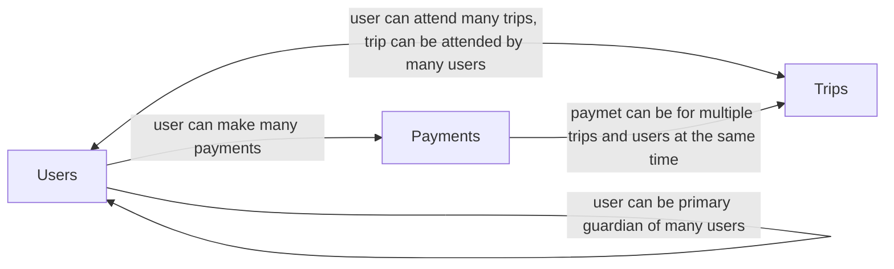

# school-payments-service

School payments service

# AI assisted usaged

- For this project I used Large Language Models to assist in brushing up on python and react, especially Fast API, it was a useful assistant to search documentation or general idiomatic python examples
- As I spent much time on the initial design of the schema and payment API endpoint and running out of time, I ended up heavily relying on AI generated code (using the likes of Claude LLM) to generate large protion of the `Trip.tsx` react component, which does contain the most complex parts of the frontend
- I think the quality of the rushed AI parts is sufficient for a proof of concept, however for a real production feature I would certainly take a more hands on approach to ensure the software quality remains up to standard

# Feature plan

- [x] View trips (seed pre-exsiting for the scope of this exercise)
- [x] Allow primary guardian to take payments for registering dependant to trip
    - [x] Single payment can be made for multiple dependants going on multiple trips
    - [x] Save primary guardian and dependants
    - [x] Save payment
    - [x] Save trip registration
    - [ ] When primary guardian returns to webapp, list their existing dependants (for production, this would REQUIRE auth)
- [ ] Add Auth
    - [ ] Email temporary login code and jwt
- [ ] Add server side kart session storage

# Local development

### Requirements

- Ability to run Makefile
- docker and docker compose

**frontend**

- nodejs
- npm

**backend**

- python
- uv

.env.example should already have defaults for local development
```
cp .env.example .env
```

**db migrations**

- Atlas CLI https://atlasgo.io/getting-started


### Dev servers for convenient development with hot reloading

**Start/stop DB**
```
make docker-db-up
```
```
make docker-db-down
```
```
make docker-db-destroy
```

**run db migrations**
```
make atlas-migrate-apply
```

**Start frontend dev server**
```
make dev-frontend
```

**Start backend dev server**
```
make dev-backend
```

### Start/stop entire stack with docker compose for testing more production like builds running locally containerized
```
docker compose up --build
```
```
docker compose down
```

# Python API

## Relational schema


